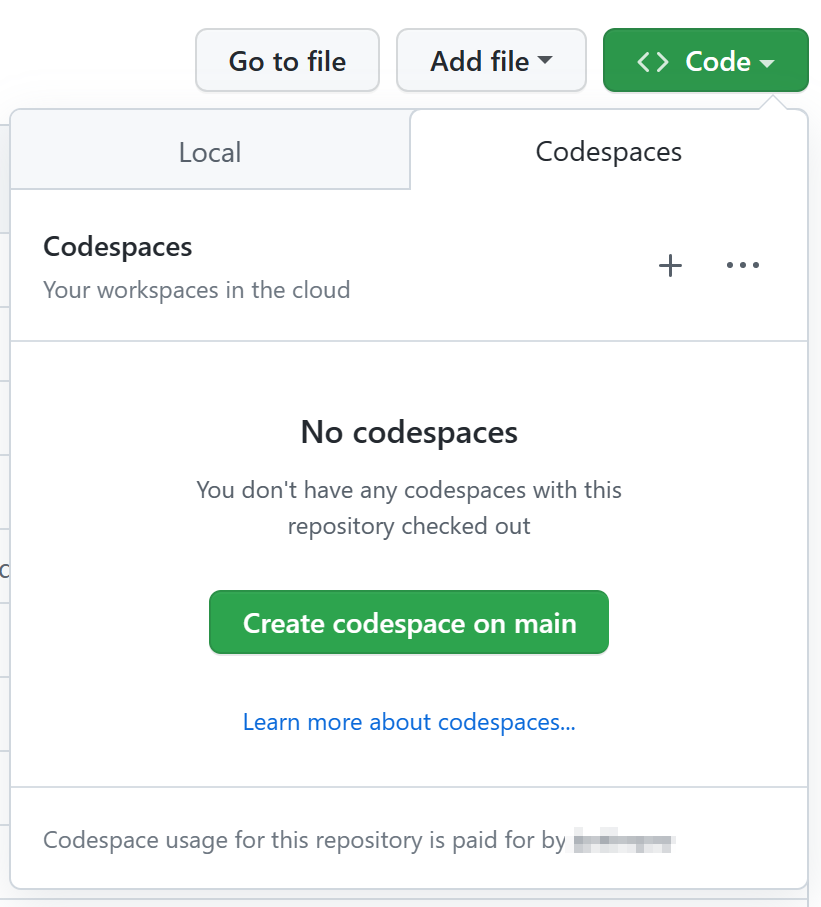
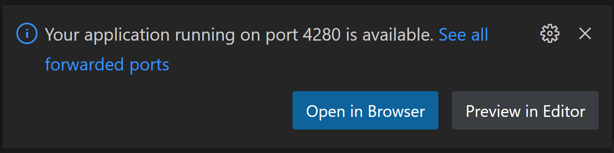
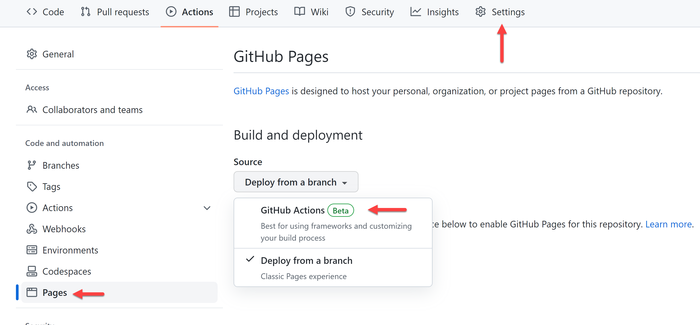
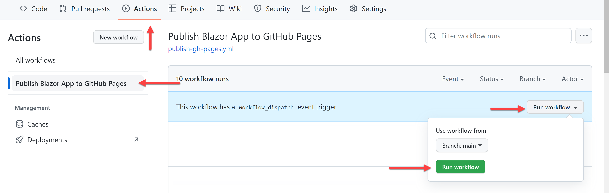

# .NET (Blazor) Webfolio - a collection of my projects, program and my resume!

This webfolio serves as a showcase of my skills, experiences, and projects. Here you'll find a curated selection of my work, including personal projects, collaborations, and professional endeavors. Additionally, you can explore my resume to learn more about my background, education, and career highlights.

## Description

A brief introduction to your project, its goals, features, and benefits.

## Installation

Instructions on how to install and run your project, including any dependencies, environment variables, and configuration files.

## Usage

Examples of how to use your project, such as code snippets, screenshots, or videos.

## Contributing

Guidelines for contributors, such as code style, testing, documentation, and pull requests.

## Project Management

Here's the table including the best tool for each process in a single column:

| **Phase**            | **Tool/Platform**                | **Description**                                                                                                                                                                                                                                                                                                        | **Reference Link**                                |
|----------------------|---------------------------------|-------------------------------------------------------------------------------------------------------------------------------------------------------------------------------------------------------------------------------------------------------------------------------------------------------------------------|---------------------------------------------------|
| Project Initiation  | Project Charter Template        | Provides a structured document outlining the project's purpose, scope, objectives, and stakeholders, serving as a formal authorization for the project.                                                                                                                                                               | [Example Template](https://www.smartsheet.com/project-charter-template) |
|                     | Stakeholder Analysis Template   | Identifies project stakeholders, their roles, interests, and influence to manage their expectations and engagement throughout the project lifecycle.                                                                                                                                                                | [Example Template](https://www.smartsheet.com/stakeholder-analysis-template) |
| Project Planning    | Gantt Chart Software            | Visualizes project tasks, dependencies, and timelines in a horizontal bar chart format, aiding in scheduling, resource allocation, and tracking progress.                                                                                                                                                            | [Tool](https://www.microsoft.com/en-us/microsoft-365/project/project-management-tools) |
|                     | Work Breakdown Structure (WBS) Tool | Breaks down project deliverables into smaller, manageable tasks, providing a hierarchical representation of project scope and activities.                                                                                                                                                                            | [Tool](https://www.mindtools.com/pages/article/newPPM_03.htm)    |
|                     | Resource Management Software    | Manages and allocates project resources, including human resources, equipment, and materials, to ensure efficient utilization throughout the project lifecycle.                                                                                                                                                         | [Tool](https://www.teamdeck.io/resource-management-tools/)     |
| Project Execution   | Task Management Software        | Tracks and organizes project tasks, assigns responsibilities, and monitors task progress in real-time, facilitating collaboration and accountability among team members.                                                                                                                                               | [Tool](https://asana.com/guide/team/get-started)             |
|                     | Communication Platform          | Facilitates seamless communication and information sharing among project team members through chat, video conferencing, file sharing, and collaboration features, enhancing team collaboration and decision-making.                                                                                                 | [Tool](https://slack.com/)                                |
|                     | Issue Tracking System           | Logs and tracks project issues, defects, and change requests, enabling prompt resolution and preventing potential project delays or quality issues.                                                                                                                                                                   | [Tool](https://www.atlassian.com/software/jira)             |
| Project Monitoring  | Progress Reporting Tool         | Generates and distributes regular progress reports to stakeholders, highlighting project status, key milestones achieved, issues encountered, and upcoming tasks, ensuring transparency and alignment with project goals.                                                                                            | [Tool](https://monday.com/)                                |
|                     | Key Performance Indicator (KPI) Dashboard | Displays project performance metrics and KPIs in a visual dashboard format, enabling stakeholders to assess project health and performance trends at a glance.                                                                                                                                                       | [Tool](https://www.tableau.com/)                            |
|                     | Risk Register Template         | Documents identified project risks, their likelihood, impact, and mitigation strategies, facilitating proactive risk management throughout the project lifecycle.                                                                                                                                                         | [Example Template](https://www.smartsheet.com/risk-register-template) |
| Project Closure    | Lessons Learned Template       | Captures insights, best practices, and areas for improvement identified during project execution, providing valuable knowledge for future projects and continuous improvement efforts.                                                                                                                                | [Example Template](https://www.projectmanagementdocs.com/template/Lessons-Learned-Register-Template.html) |
|                     | Project Closure Checklist      | Outlines tasks and activities necessary for closing out the project, including administrative closure, finalizing deliverables, conducting project reviews, and transitioning resources, ensuring a systematic approach to project closure.                                                                              | [Example Checklist](https://www.projectmanager.com/templates/project-closure-checklist) |
|                     | Post-Implementation Review Tool | Conducts a formal evaluation of project outcomes, comparing actual results against initial objectives and identifying successes, challenges, and areas for future improvement, enabling organizational learning and development.                                                                                          | [Tool](https://www.smartsheet.com/post-implementation-review-template) |

In this table, each process is associated with the best tool or platform commonly used for that specific phase of the project management lifecycle.

This project uses the following project management tools and techniques:

- [Waterfall project management](https://www.forbes.com/advisor/business/project-management-techniques/): A traditional, sequential approach that breaks the project into different phases. Each phase must be completed before the next one begins.
- [Gantt chart](https://www.atlassian.com/work-management/project-management): A visual representation of the project schedule, showing the start and end dates, dependencies, and progress of each task.
- [Work breakdown structure (WBS)](https://www.actitime.com/project-management/project-management-tools-and-techniques): A hierarchical decomposition of the project scope into smaller, manageable deliverables. Each deliverable has a clear definition, owner, and deadline.
- [PERT chart](https://www.projectcentral.com/blog/project-management-techniques/): A network diagram that shows the sequence and duration of project activities, as well as the critical path and slack time.
- [Risk management](https://asana.com/resources/project-management-methodologies): A process of identifying, analyzing, and mitigating potential threats and uncertainties that may affect the project outcomes.
- [Stakeholder management]: A process of identifying, engaging, and communicating with the people who have an interest or influence on the project.

## Resources

Some useful resources for learning more about project management:

- [The Ultimate Project Management Guide]: A comprehensive guide that covers the basics, best practices, and tips for project management.
- [Project Management Methodologies]: A comparison of 12 popular project management frameworks, such as agile, scrum, kanban, and lean.
- [Project Management Tools and Techniques]: A list of 20 essential project management tools and techniques, such as SWOT analysis, SMART goals, and RACI matrix.
- [Project Management Podcasts]: A selection of 10 podcasts that cover various topics and trends in project management.
- [Project Management Blogs]: A collection of 15 blogs that offer insights, advice, and inspiration for project managers.

## License

Information about the license of your project, such as the type, terms, and conditions.


Thank you for visiting my Webfolio! I hope you enjoy exploring my projects and resume. Feel free to reach out if you have any questions or feedback.

_Create, customize and deploy your own portfolio website in minutes._ ✨

In this template repository we have the development environment and base set and ready to go. So that you can immediately launch the Codespaces to customize with no setup.

* **Who is this for?** __Anyone__ looking to create a portfolio site, learn web development, or test out Codespaces.
* **How much experience do you need?** __Zero__. You decide how much you want to customize based on your experience, and time available.
* **Tools needed:** _None_. No need to install anything! All you need is a web browser.
* **Prerequisites:** _None_. This template includes your development environment and deployable web app for you to create your own site.

## About this portfolio template

In this "choose your own adventure" template portfolio, we have a [Blazor](https://dotnet.microsoft.com/apps/aspnet/web-apps/blazor?WT.mc_id=dotnet-82024-juyoo) based web application ready for you to easily customize and deploy using only your web browser.  


### Quick Start

1. Click the **Use this Template** button
   
   [](https://github.com/education/codespaces-project-template-dotnet/generate)
1. Select the repository owner (e.g. your GitHub account)
1. Enter a unique name for your new repository
1. Click the **Code** button
1. Click **Create Codespace on main** button
1. [Customize your portfolio site](#-customize-your-site-in-4-steps)
1. [Deploy your site](#-deploy-your-web-application)

<details>
   <summary><b>🎥 To learn more about Codespaces, watch our video tutorial series</b></summary>
   
   [](https://aka.ms/CodespacesVideoTutorial "Codespaces Tutorial")
</details>

<br />

## 🗃️ .NET (Blazor) Portfolio template

This repo is a GitHub template to build a .NET personal portfolio frontend web application using the Blazor WebAssembly framework. The goal is to give you a template to you can immediately utilize to create your own website through Codespaces.

The repo contains the following:

* `/.devcontainer`
  - `.devcontainer/Dockerfile`: Configuration file used by Codespaces to determine operating system and other details.
  - `.devcontainer/devcontainer.json`: Configuration file used by Codespaces to configure Visual Studio Code settings, such as the enabling of additional extensions.
  - `.devcontainer/on-create.sh`: Configuration file used by Codespaces to install additional tools, such as PowerShell.
* `/src`: Blazor WebAssembly project to build your portfolio site.
* `.editorconfig`: Settings for [EditorConfig](https://editorconfig.org/) that helps maintain consistent coding styles in Codespaces.
* `global.json`: Settings for the Blazor WebAssembly app to avoid using pre-released .NET version.
* `swa-cli.config.json`: Settings for [Azure SWA CLI](https://azure.github.io/static-web-apps-cli/) to run the Blazor WebAssembly app on your Codespaces.
* `MyPortfolio.sln`: The solution file that contains the Blazor WebAssembly application project.

<br />

## 🚀 Getting started

This portfolio site project is filled with sample data so that you can immediately open Codespaces, see it running, and deploy at any point.

Your development environment is all set for you to start. Based on our [.NET Codespaces Template](https://github.com/education/codespaces-teaching-template-dotnet), here is what's already setup and ready for you to use:

* Simple [Blazor WebAssembly](https://dotnet.microsoft.com/apps/aspnet/web-apps/blazor?WT.mc_id=dotnet-82024-juyoo) application with components for each section of the portfolio site
* [SWA CLI](https://azure.github.io/static-web-apps-cli/) in place to build your site when deploying
* Code linting and formatting using [EditorConfig](https://editorconfig.org/) for code consistency.

### Create your portfolio

1. Create a repository from this template. Use this [create repo link](https://github.com/education/codespaces-teaching-template-dotnet/generate). Select the repository owner, provide a name, a description if you'd like and if you'd like the new repository to be public or private.
2. Navigate to the main page of the newly created repository.
3. Under the repository name, use the Code drop-down menu, and in the Codespaces tab, select "Create codespace on main".

    
    
4. Wait as GitHub initializes the Codespaces.

    
    
5. When complete you will see your Codespaces load with a terminal section at the bottom. Here you will see `dotnet restore && dotnet build` executing. When complete you will return to the terminal prompt where you can run the web application by executing: `swa start`.

   When the web application is started you will see a prompt telling you it started successfully on port 4280, and you can open that site within your browser:

   

<br />

## ✨ Customize your site in 4 steps

This project is built to be easily customizable. Each section of the site is a separate component, and your information needs to be set in only one spot. This is not only for ease of updating, but so you can see how prop values are passed to React components.

For each step, open the project in Codespaces, then you can make and commit your changes while within your Codespaces. 

> See [Using source control in your codespaces](https://docs.github.com/codespaces/developing-in-codespaces/using-source-control-in-your-codespace) for more Codespaces source control how-tos

### 1️⃣ Add your details and social media accounts

Open `/src/BlazorApp/wwwroot/sample-data/siteproperties.json`. This is a JSON object that hold the key value pairs needed to customize your name, title, email, and social media accounts.

```jsonc
{
  "name": "Alexandrie Grenier",
  "title": "Web Designer & Content Creator",
  "email": "alex@example.com",
  "gitHub": "microsoft",
  "devDotTo": null,
  "instagram": "microsoft",
  "linkedIn": "satyanadella",
  "medium": "",
  "twitter": "microsoft",
  "youTube": "microsoft",
};
```

Update to the name and title you'd like displayed at the top of your site.

_Optional values_ are email address and social accounts. These are used in the `Footer` component. If any item is not included in the list or set to an empty string ("") it will not display the icon and link.

### 2️⃣ Update images

This portfolio site includes 3 images: top section background, "About me" background and portfolio section (desk). These can be any **landscape** sized images of your choosing from your own collection, or found that have a license allowing you to use without attribution.

A couple possible sites to find photos are [Pixabay](https://pixabay.com/) and [Unsplash](https://unsplash.com). Photos, illustrations, vectors, your choice! When you find your images, save each one to `/src/BlazorApp/wwwroot/images` with a short, meaningful file name.

Open `/src/BlazorApp/wwwroot/sample-data/heroimages.json` and update images with your preferred ones, as well as the alt text for each image:

```jsonc
[
  {
    // Home component
    // section at top of the page, main image you will see when site loads (woman standing by server wall in sample)
    "name": "home",
    "src": "images/server-wall.jpg",
    "alt": "woman holding laptop standing by server room with glass wall"
  },
  {
    // About me component
    // background behind the detailed "about me" section (abstract mosaic in sample)
    "name": "about",
    "src": "images/mosaic.svg",
    "alt": "purple and blue abstract background"
  },
  {
    // Portfolio component
    // image highted in left hand side of section (design desk photo in sample)
    "name": "portfolio",
    "src": "images/design-desk.jpeg",
    "alt": "desktop with books and laptop"
  }
]
```

### 3️⃣ Add your "about me"

The about section helps to give people a bit more information about your skills and passions. Open `/src/BlazorApp/wwwroot/sample-data/aboutme.json` and update those 3 properties:

* `description`: short sentence or two describing yourself, career goal, and/or passions
* `skillsList`: an [array](https://developer.mozilla.org/docs/Web/JavaScript/Reference/Global_Objects/Array) of your skills to list on the site, can be as many or little as you wish
* `detailOrQuote`: longer block for you to add more detail about yourself, or even a quote you like


### 4️⃣ Add items you've worked on and detail text

This section to update is portfolio, where you highlight items you've worked on. These would be articles, videos, logo designs, GitHub projects, anything that highlights you!

Open `/src/BlazorApp/wwwroot/sample-data/projects.json` that is a JSON array. Each item you want to highlight needs: title, description, and URL.

The sample design has 4, but the number you include is up to you.

```jsonc
[
  {
    "title": "10 Things To Know About Azure Static Web Apps 🎉",
    "description": "Collaboration to create a beginner friendly article to help explain Azure Static Web Apps and tooling to get started.",
    "url": "https://dev.to/azure/10-things-to-know-about-azure-static-web-apps-3n4i"
  },
  {
    "title": "Web Development for Beginners",
    "description": "Contributed sketch note imagery to accompany each lesson. These help provide visual representation of what is being taught.",
    "url": "https://github.com/microsoft/web-dev-for-beginners"
  },
  {
    "title": "My Resume Site",
    "description": "Created from Microsoft's resume workshop and deployed to GitHub pages. Includes my experience and design abilities.",
    "url": "https://github.com/microsoft/workshop-library/tree/main/full/build-resume-website"
  },
  {
    "title": "GitHub Codespaces and github.dev",
    "description": "Video interview to explain when to use GitHub.dev versus GitHub Codespaces, and how best to use each tool.",
    "url": "https://www.youtube.com/watch?v=c3hHhRME_XI"
  }
]
```

<br/>

## 🏃 Deploy your web application

Project includes the setup needed for you to deploy **free** to both [Azure Static Web Apps](https://azure.microsoft.com/products/app-service/static/?WT.mc_id=dotnet-82024-juyoo) and [GitHub Pages](https://pages.github.com/)</a>.

### Azure Static Web Apps

[Azure Static Web Apps](https://azure.microsoft.com/products/app-service/static/?WT.mc_id=dotnet-82024-juyoo) is Microsoft's hosting solution for static sites (or sites that are rendered in the user's browser, not on a server) through Azure. This service provides additional opportunities to expand your site through Azure Functions, authentication, staging versions and more.

You'll need both Azure and GitHub accounts to deploy your web application. If you don't yet have an Azure account you can create it from within during the deploy process, or from below links:

* [Create a (no Credit Card required) Azure For Students account](https://azure.microsoft.com/free/students/?WT.mc_id=dotnet-82024-juyoo)
* [Create a new Azure account](https://azure.microsoft.com/free/?WT.mc_id=dotnet-82024-juyoo)

With your project open in Codespaces:

1. Click Azure icon in the left sidebar. Log in if you are not already, and if new to Azure, follow the prompts to create your account.
1. From Azure menu click "➕" sign and then choose "Create Static Web App".

   

1. If you are not logged into GitHub you will be prompted to log in. If you have any pending file changes you will then be prompted to commit those changes.
1. Set you application information when prompted:
    1. **Name for Static Web App**: enter the name for the Static Web App. Default to your GitHub repository name.
    1. **Region**: pick the one closest to your region
    1. **Project structure**: select "Blazor"
    1. **Location of application code**: enter `/src/BlazorApp`
    1. **Output location**: enter `wwwroot`
1. When complete you will see notification at the bottom of your screen, and a new GitHub Action workflow will be added to your project. If you click "Open Action in GitHub" you will see the action that was created for you, and it is currently running.

> 🤩 **Bonus**: [Setup a custom domain for your Azure Static Web App](https://learn.microsoft.com/shows/azure-tips-and-tricks-static-web-apps/how-to-set-up-a-custom-domain-name-in-azure-static-web-apps-10-of-16--azure-tips-and-tricks-static-w/?WT.mc_id=dotnet-82024-juyoo)

### GitHub Pages

[GitHub Pages](https://pages.github.com/) allows you to host websites directly from your GitHub repository. This project is already set up for you to get your portfolio deployed to GitHub pages with minimal steps.

On your GitHub repository:

1. Go to the "Settings" tab and navigate to the "Pages" menu.
1. Under the _Build and deployment_ section, select the source to **GitHub Actions**.

    

1. Ensure your GitHub Pages visibility to **Public**.
1. Run a GitHub Action workflow by pushing code or manually invoke it.

    

1. Visit your GitHub Pages.

    

> 🤩 **Bonus**: [Setup a custom domain for your GitHub pages site](https://docs.github.com/pages/configuring-a-custom-domain-for-your-github-pages-site/managing-a-custom-domain-for-your-github-pages-site)

<br />

## 🏆 Challenges

Below are 4 additional ways you can continue to customize your portfolio site and learn some Codespaces, CSS, HTML and JavaScript along the way.

  1. [Customize your Codespaces](#1-customize-your-codespaces)
  1. [Update to smooth scroll to a section](#2-update-to-smooth-scroll-to-a-section)
  1. [Animate the desk photo](#3-animate-desk-photo)
  1. [Add a new section](#4-add-a-new-section)

### 1. Customize your Codespaces

Your environment comes with preinstalled extensions. You can change which extensions your Codespaces environment starts with, here's how:

1. Open file _.devcontainer/devcontainer.json_ and locate the following JSON element **extensions**

   ```jsonc
   "extensions": [
     "GitHub.copilot",
     "GitHub.copilot-chat",
     "GitHub.copilot-labs",
     "ms-dotnettools.csharp",
     "ms-vscode.PowerShell",
     "ms-vscode.vscode-node-azure-pack",
     "VisualStudioExptTeam.vscodeintellicode"
   ]
   ```

1. Let's add the `indent-rainbow` extension. To do this, go to the **extensions** list and add:

   ```jsonc
   "oderwat.indent-rainbow"
   ```
  
   What you did above was to add the unique identifier of an extension of the [indent-rainbow](https://marketplace.visualstudio.com/items?itemName=oderwat.indent-rainbow&WT.mc_id=dotnet-82024-juyoo). This will let Codespaces know that this extension should be pre-installed upon startup.

To find the unique identifier of an extension:

* Navigate to the extension's web page, like so [https://marketplace.visualstudio.com/items?itemName=oderwat.indent-rainbow](https://marketplace.visualstudio.com/items?itemName=oderwat.indent-rainbow&WT.mc_id=dotnet-82024-juyoo)
* Locate the _Unique Identifier_ field under **More info** section on your right side.
   
> 💡 Learn more here, <https://docs.github.com/codespaces/customizing-your-codespace/personalizing-github-codespaces-for-your-account>


### 2. Update to smooth scroll to a section

In your site header you have links to each section below. Click one of these links and watch it scroll the page to that section. Not really a scroll, right?

Let's make this a better user experience by slowing that down so the user has a sense of what is happening, and where they are navigating to on the page. 

1. Open `/src/BlazorApp/wwwroot/css/app.css`, which is the stylesheet for your portfolio application. We need to add a style for `html`. If you look, you'll see right now `html` and `body` styles are being set together, so let's add the following css snippet to set the scrolling for the `html` element:

    ```css
    html {
      scroll-behavior: smooth;
    }
    ```

Your site should already be running in your Codespaces, and the change will reload onto the page automatically. Click a link in the top header to see the smooth scroll in action.

### 3. Animate desk photo

Animations are a way you can easily add some motion to elements on your page to increase user interactivity and highlight items you want to make sure they notice. Let's animate the desk photo in the portfolio section. 

1. Open your site's stylesheet, `/src/BlazorApp/wwwroot/css/app.css` within your Codespaces. Add the animation sequence by adding a `@keyframes` definition to slide in from the left:

    ```css
    @keyframes slideInLeft {
      0% {
        transform: translateX(-100%);
      }
      100% {
        transform: translateX(0);
      }
    }
    ```

1. Now that we have defined our `slideInLeft` animation sequence we can tell our desk photo to animate itself with that sequence. Open `/src/BlazorApp/Components/Portfolio.razor` and locate the `img` tag. You will see it utilizes inline CSS to set it's styling. Within it's style definition add the following:

    ```css
    animation: 1s ease-out 0s 1 slideInLeft;
    ```

    Your image tag should look something like:

    ```html
    
    ```

Your site should already be running in your Codespaces, and the change will reload onto the page automatically. Scroll up and down the page and watch your desk photo slide onto the page.

> 🤩 **Bonus**: Animate scroll down arrow


### 4. Add a new section

We started you off with a few basic sections for your portfolio site, but you have creative freedom to make it your own and add new sections relevant to what you want on your site.

For an example, let's add an education section to your portfolio site. 

1. Create a new component for the section within the `Components` folder. Add a new file called `Education.razor`.

1. In `Education.razor` add the component function, export and information you'd like to include:

    ```razor
    <section class="light" id="portfolio">
        <h2>Education</h2>
    </section>
    ```

1. In `Index.razor` add the `Education` component where you would like it to render within the page by inserting:

    ```razor
    <Education />
    ```

In your Codespaces, your portfolio application should be running and will reload your site with the changes. 


<br />

## 📚 Resources

* [GitHub Codespaces docs overview](https://docs.github.com/codespaces/overview)
* [GitHub Codespaces guides](https://docs.github.com/codespaces/guides)
* [Use dev containers locally with VS Code and Docker](https://github.com/microsoft/vscode-remote-try-dotnet#vs-code-dev-containers)
* [Get started with Blazor](https://learn.microsoft.com/training/paths/build-web-apps-with-blazor/?WT.mc_id=dotnet-82024-juyoo)
* [Web Development for Beginners](https://github.com/microsoft/Web-Dev-For-Beginners)

> #### Codespaces Browser App
>
> If you are using Edge or Chrome you will see an option to install the Codespaces app when you launch your Codespaces. The Codespaces app lets you launch your Codespaces within the app so you can work outside of the browser.  Look for the app icon and install pop-up to try it out.
>
> 

<br />

## 🔎 Found an issue or have an idea for improvement?

Help us make this template repository better by [letting us know and opening an issue!](/../../issues/new).
